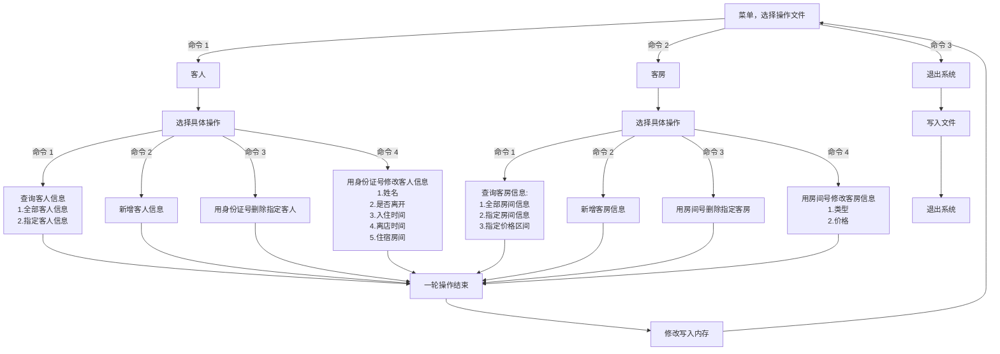
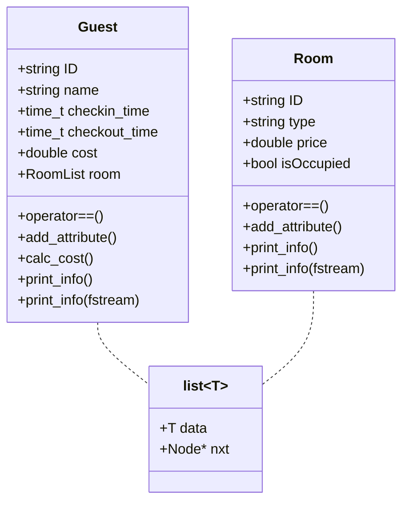
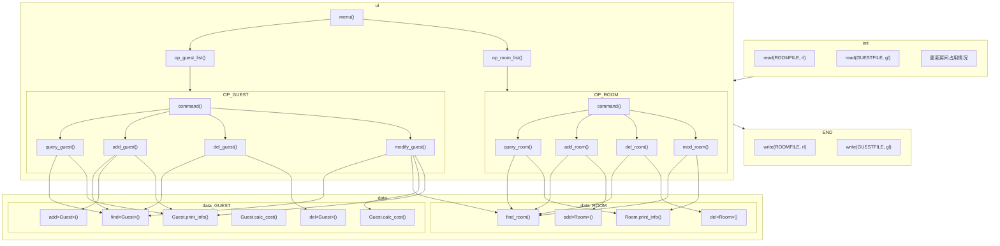

# 项目说明

本项目为大一高级语言程序设计大作业。

关于本项目的设计，详见 `9_酒店管理系统.pdf`。

本项目用到了很多 c++17 的特性，请确保使用的编译器版本够高并使用 `-std=c++17` 编译。

如果您是旧版 devc++ 受害者，您可以在[这里](https://github.com/niXman/mingw-builds-binaries/releases)在找到最新版本的编译器，并跟着[这篇教程](https://zhuanlan.zhihu.com/p/438701242)配置devc++。

本项目用到了：

- 各种 c++ 基础语法
- `template<typename T>` 的使用
- `<string>` 相关操作
- `<memory>` 中的智能指针
- 结构体、单链表
- `<fstream>` 文件读写
- [ctime库的使用](https://blog.csdn.net/u013043408/article/details/83615582)，以及 `<sstream>` 和 `<iomanip>` 用于读入指定格式的时间
- 用 `<stdexcept>` 中的 `try-catch` 处理输入信息时的报错
- mermeid 绘制示意图

# 功能模块示意图

# 数据结构示意图

# 函数调用示意图

# 致谢

感谢我的组员帮我写了一些代码，还有一个好看的 ui 界面。

可视化因为还没有玩明白所以先不加了。

感谢 fitten code 救我狗命，不然写 `<ctime>` 库的时候我就原地爆炸了。

感谢 github 为了种种原因把默认分支改成 main，让我 `push master` 的时候各种出错最后删了十几次库。